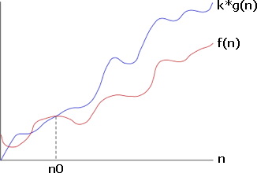
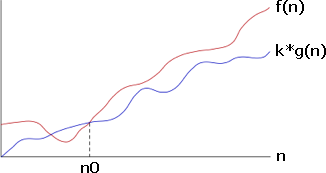
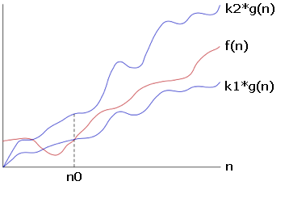

# Асимптотический анализ

Асимптотический анализ оценивает темп роста сложности времени (Time Complexity) и пространства (Space complexity) для большого объёма входных данных.

При асимптотическом анализе используются условные единицы времени и пространства, не учитывающие программные, аппаратные и любые другие объективные различия, влияющие на базовые операции и структуры данных.

# Асимптотическая нотация: Big-O, Big-Ω (omega), Big-Θ (theta)

Далее $n_0$  — величина, после которой $n$ становится значительно большой, чтобы ограничить $f(n)$.

## Big-O

Big-O определяет верхнюю границу сложности выполнения.

$f(n) ∈ O(g(n))$ (читается как "f(n) ограничена сверху О-большим функцией g(n)"), если:

- $∃ k > 0$
- $∃ n_0, 0 ≤ n_0 ≤ n$
- $f(n) ≤ k×g(n)$



## Big-Ω

Big-Ω определяет нижнюю границу сложности выполнения.

$f(n) ∈ Ω(g(n))$, если:

- $∃ k > 0$
- $∃ n_0, 1 < n_0 ≤ n$
- $f(n) ≥ k×g(n)$



## Big-Θ

Big-Θ определяет одновременно верхнюю и нижнюю границы сложности выполнения.

$f(n) ∈ Θ(g(n))$, если:

- $∃ k_1 > 0, ∃ k_2 > 0$
- $∃ n_0, 0 ≤ n_0 ≤ n$
- $k_1×g(n) ≤ f(n) ≤ k_2×g(n)$



## Big-O, Big-Ω (omega), Big-Θ (theta), на примере Quick Sort

- **Худший случай** времени выполнения — $O(n^2)$: элементы отсортированы в обратном сортируемому порядке, а в качестве опорного элемента выбран максимальный (минимальный).
- **Лучший случай** времени выполнения — $Ω(n)$: элементы равны, алгоритм пройдёт по элементам один раз.
- **Ожидаемый случай** времени выполнения — $Θ(n*logn)$: опорный элемент не слишком близок к середине, но и не максимальный (минимальный).

Почему при анализе алгоритмов используется именно О-большое?

См. [Common Asymptotic Notations](https://www.educative.io/courses/data-structures-in-cpp-an-interview-refresher/JYYpmPpB1vD).

## Асимптотическая нотация: Little-o, Little-ω (omega)

o и ω обозначают то же, что соответственно O и Ω, но не включая худший/лучший случаи соответственно.

# Big-O

## Типичные функции O и их порядки роста


- $O(1)$, $O(N^0)$ - constant
- $O(logN)$ - logarithmic (binary search)
- $O(log^2N)$ - log-square
- $O(\sqrt N)$ - Root-N
- $O(N)$ - linear
- $O(N logN)$ - linearithmic (mergesort, quicksort)
- $O(N^2)$ - quadratic (bubble sort, selection sort, insertion sort)
- $O(N^3)$ - cubic
- $O(N^4)$ - quartic
- $O(2^N)$, $O(e^N)$ - exponential (recursive problems)
- $O(N!)$ - N-factorial (permutations)

## Амортизированное время

Амортизированное (среднее) время выполнения для множества повторений операции может быть гораздо более оптимистичным, нежели время выполнения в худшем случае для однократного исполнения.

Пример: vector предоставляет гибкость в размере, его вместимость изменяется во время вставки элементов: когда выделенный объём подходит к концу, генерируется вдвое больший по размеру vector , в который копируется старый vector. Как в подобном случае описать время выполнения вставки?

Худший случай: выделенный объём подошёл к концу, для вставки необходимо создать новый vector длины 2*N и затем скопировать в него N прежних элементов. Получаем сложность O(N). Однако, такое будет происходить нечасто. БОльшая часть вставок будет иметь сложность O(1), поскольку расширение памяти не будет требоваться.

Концепция амортизированного времени выполнения позволяет учесть два этих фактора: да, худший случай происходит время от времени, но нечасто, поэтому оценку можно сгладить, то есть амортизировать.

Во время каждого расширения, объём удваивается и выполняется копирование старых данных в новый блок памяти. Таким образом, (1 + 2 + 4 + ... + N) элементов копируется во время вставки N-ого элемента. (1 + 2 + 4 + ... + N) можно считать справа-налево, тогда последовательность начинается с N и делится пополам до достижения 1: (N + N/2 + N/4 + ... + 1), что равняется 2*N. Таким образом, вставка занимает O(2*N) времени выполнения, но амортизированное время для вставки O(1).

## Расчёт O времени выполнения

### Формулы для расчёта

$\sum_{i=1}^n c = c + c + c + ... + c → cn$

$\sum_{i=1}^n i = 1 + 2 + 3 + ... + n → \frac{n(n+1)}{2}$

$\sum_{i=1}^n i^2 = 1 + 4 + 9 + ... + n^2 → \frac{n(n+1)(2n+1)}{6}$

$\sum_{i=0}^n r^i = r^0 + r^1 + r^2 + ... + r^n → \frac{r^{n+1}-1}{r-1}$

$\sum_{i=1}^{n-1} f(n) = \frac {n-1}{2} (f(1) + f(n))$

### Отбрасывание констант

O-большое описывает темп роста, поэтому константы в функции времени выполнения отбрасываются.

Например: $O(2*N) → O(N)$.

Кто-то оставляет константы, обосновывая это тем, что так точнее. Сравните код 1:

```cpp
for (int x: array) {
  if (x < min) min = x;
  if (x > max) max = x;
}
```

... с кодом 2:

```cpp
for (int x: array) { if (x < min) min = x; }
for (int x: array) { if (x > max) max = x; }
```

Который выполняется быстрее? У первого один цикл, против двух во втором. Но в первом запись лаконичнее. Считать число инструкций всё равно, что вернуться к уровню ассемблерного кода, в котором можно брать во внимание факты по типу: умножение требует выполнение большего числа инструкций процессора. Подобные вещи чересчур усложняют разработку и не берутся во внимание. O-большое позволяет оценить как масштабируется время выполнения.

### Отбрасывание недоминантных членов

Как сократить запись $O(N^2 + N)$?

Второй N не является константой, но в функции времени выполнения он должен быть отброшен и вот почему: к примеру, $O(N^2 + N^2) = O(2*N^2) → O(N^2)$ — мы отбросили $N^2$, а значит, $N$ подавно не должен быть отброшен.

Другие примеры:

$O(N + logN) → O(N)$

$O(5 * 2^N + 1000 * N^{100}) → O(2^N)$

### Почему для O не имеет значения основание логарифма?

Для положительных a, b, n справедлива формула: $log_an=\frac{log_bn}{log_ba}$

Поскольку a и b константы, $log_aN$ и $log_bN$ различаются только множителем $log_ba$, который является константой, а следовательно его нужно отбросить.

### Сложение и умножение времён выполнения

В каком случае времена выполнения складываются, а когда умножаются?

Сложение времён выполнения — $O(A + B)$:

```cpp
for (int a : arrA) { print(a); }
for (int b : arrB) { print(b); }
```

Выполняется A проходов, затем B проходов — общее число проходов складывается.

Умножение времён выполнения — $O(A*B)$:

```cpp
for (int a : arrA) {
  for (int b : arrB) {
    print(a + "," + b);
  }
}
```

Выполняется B проходов над каждым из проходов A, поэтому времена выполнения перемножаются.
